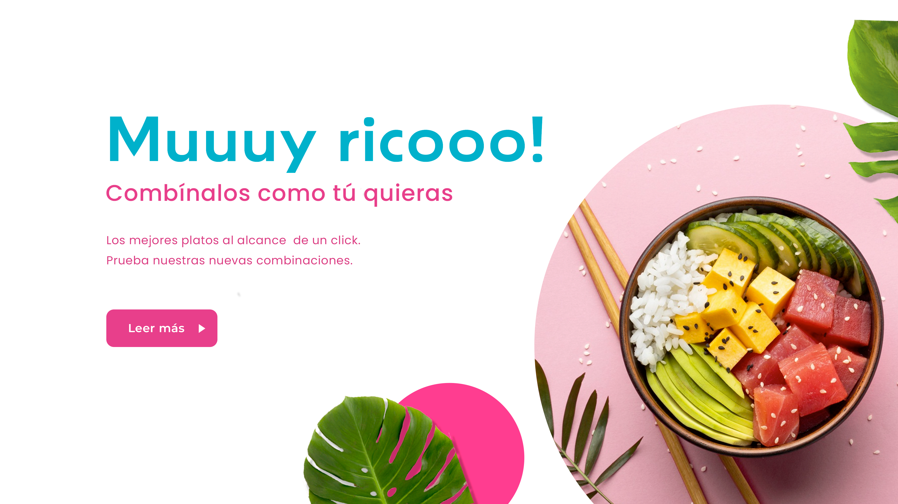

# suricata_foods
Bienvenidos a Suricata Foods, una página web diseñada para una empresa ficticia de alimentos innovadores. Este proyecto está enfocado en mostrar mis habilidades en diseño web, desarrollo frontend y manejo de tecnologías como HTML5, CSS3, javascriipt y Bootstrap.

🚀 Objetivo del proyecto

El objetivo de Suricata Foods es ofrecer una experiencia de usuario moderna y funcional, presentando productos de la empresa, contacto con los clientes y un diseño responsivo que se adapte a diferentes dispositivos. Este proyecto está desarrollado como parte de mi portafolio para demostrar mis habilidades en:

Creación de interfaces atractivas y funcionales.
Desarrollo de páginas web responsivas.
Uso de frameworks y buenas prácticas de diseño web.
🔧 Tecnologías utilizadas

HTML5: Estructura semántica de la página.
CSS3: Estilos personalizados para el diseño visual.
Bootstrap 5: Framework CSS para el diseño responsivo y componentes preconstruidos.
JavaScript: Para interacción dinámica y experiencia de usuario.
GitHub Pages: Hosting del sitio web.
💻 Características principales

Diseño responsivo: Adaptación a cualquier dispositivo, incluyendo móviles, tablets y computadoras de escritorio.
Navegación clara: Menú de navegación con enlaces que realizan desplazamiento suave hacia las secciones de la página.
Sección de Productos: Presenta una serie de tarjetas con productos que ofrecen información visual y textual.
Formulario de Contacto: Permite a los usuarios ponerse en contacto con la empresa de manera rápida.
UI personalizada: Uso de colores, tipografías y estilos visuales consistentes con la marca.

🖼️ Capturas de pantalla

Pantalla principal: 

